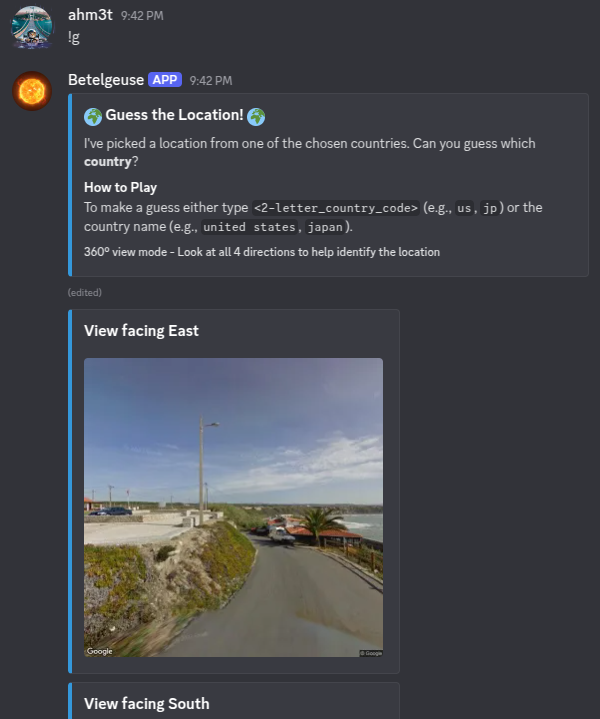
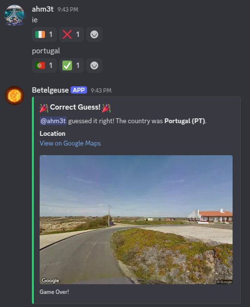
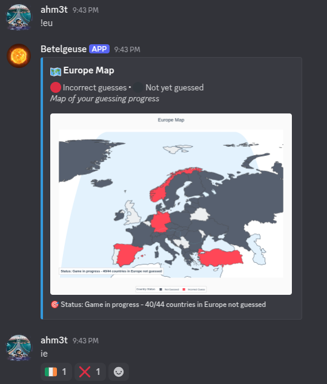

# Country Guesser Discord Bot 🌍

A GeoGuessr-inspired Discord bot that challenges users to guess countries based on Google Street View images. Test your geographical knowledge and compete with friends in an interactive guessing game!


## How to Play

- `!g` - Start a new Street View guessing game (bot selects a random country from 110 countries with Street View coverage). You get 4 Street View images from the same location facing North, East, South, and West. Guess countries by typing 2-letter codes (e.g., `us`, `jp`) or full names (e.g., `united states`, `japan`). Get real-time reactions with country flags (✅ for correct, ❌ for incorrect). Receive the Google Maps link upon correct guess.







- `!stop_g` - Stop the current game (requires manage_messages permission)
- `!hint` or just `hint` - Get an additional location from the same country (4-second cooldown)
- `!list` - Display paginated list of all available countries with letter codes.
- `!help` - Show all available commands

### Map Commands
- `!eu` - Display Europe map
- `!as` - Display Asia & Oceania map
- `!af` - Display Africa map
- `!am` - Display North-South America map




## Setup Instructions

### Prerequisites
- Discord Bot Token
- Google Maps API Key with Street View and Geocoding APIs enabled

### Installation

1. **Clone the repository**
   ```bash
   git clone https://github.com/alaahmet/country-guesser.git
   cd country-guesser
   ```

2. **Install dependencies**
   ```bash
   pip install -r requirements.txt
   ```

3. **Environment Configuration**
   Create a `.env` file in the project root:
   ```env
   GOOGLE_MAPS_API_KEY=your_google_maps_api_key_here
   DISCORD_BOT_TOKEN=your_discord_bot_token_here
   ```

4. **Google Maps API Setup**
   - Go to [Google Cloud Console](https://console.cloud.google.com/)
   - Create a new project or select existing one
   - Enable the following APIs:
     - Street View Static API
     - Geocoding API
   - Create credentials (API Key)
   - Copy the API key to your `.env` file

5. **Discord Bot Setup**
   - Go to [Discord Developer Portal](https://discord.com/developers/applications)
   - Create a new application
   - Go to "Bot" section and create a bot
   - Copy the bot token to your `.env` file
   - Invite the bot to your server with necessary permissions:
     - Send Messages
     - Embed Links
     - Attach Files
     - Add Reactions
     - Read Message History
     - Manage Messages

6. **Run the Bot**
   ```bash
   python main.py
   ```

### File Structure
```
country-guesser/
├── main.py              # Bot entry point
├── g.py                 # Main bot logic and commands
├── countries.txt        # Country name to code mappings
├── country_bounds.txt   # Geographic boundaries for each country
├── continents.json      # Continental groupings
├── requirements.txt     # Python dependencies
├── data/
│   └── ne_admin_0_map_units_50m.geojson  # World map data
└── .env                 # Environment variables (create this)
```

### Troubleshooting

**Bot not responding:**
- Check if the bot token is correct
- Ensure the bot has proper permissions in the channel
- Verify the bot is online in your Discord server

**Street View not loading:**
- Verify Google Maps API key is valid
- Check if Street View Static API is enabled
- Ensure you have sufficient API quota
- Check your API restrictions
